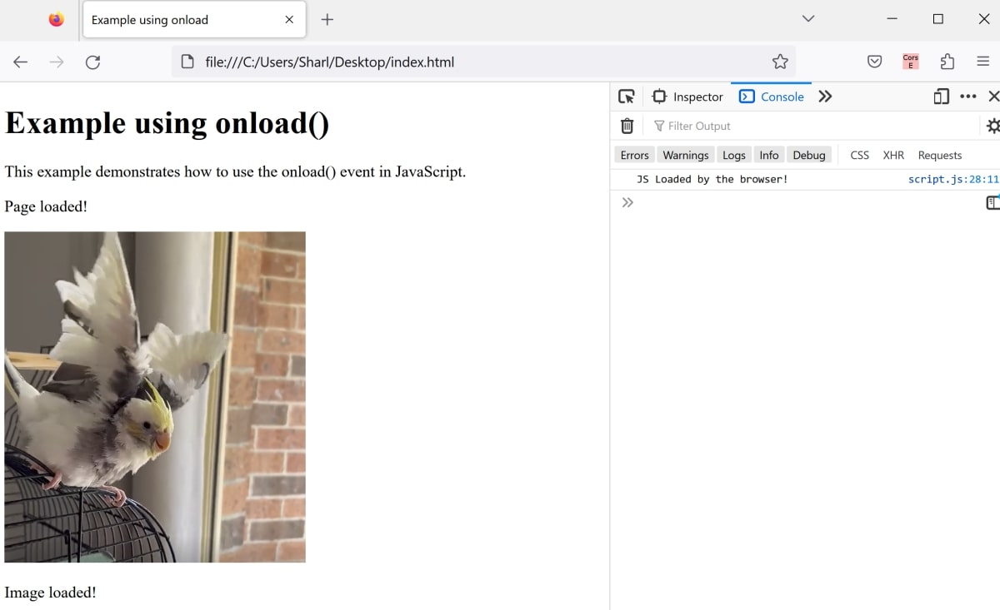

# HTML-JS-Onload-Events
This is a HTML/JS webpage that uses different onload event examples.

JS event and onload attributes for:
* Body HTML tag
* Image HTML tag
* JS file loaded in browser

# To Run

* Open the app folder
* Open index.html to view it in the browser

# Example

